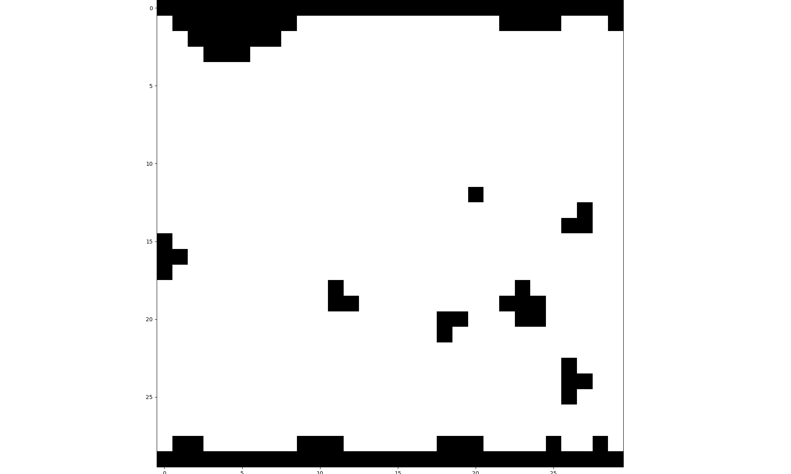
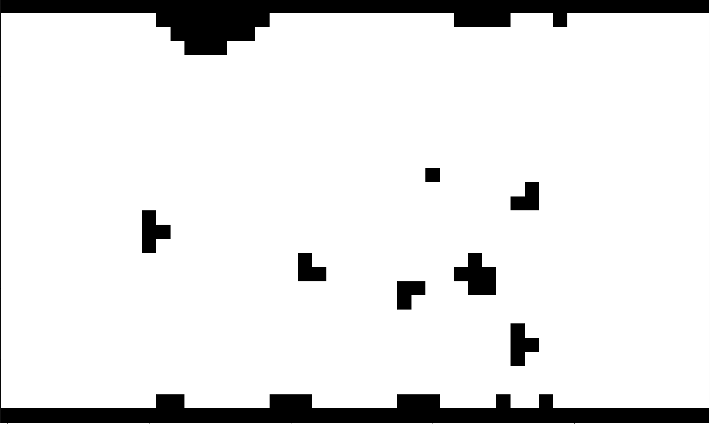

# MPPI-IPDDP C++

Implementation of the [MPPI-IPDDP](https://arxiv.org/abs/2208.02439) in C++.

# Key Features
- Header only solver
- CPU multi-processing
- Benchmark with MPPI variants
- Collision Checker can be modified on demand
- Custom model can be easily configured

# Usage
### Download Dependencies
- [autodiff](https://github.com/autodiff/autodiff)
- [Eigen 3.3.9](https://gitlab.com/libeigen/eigen/-/releases/3.3.9)
- [EigenRand](https://github.com/bab2min/EigenRand)
- [BARN_dataset](https://www.cs.utexas.edu/~xiao/BARN/BARN.html)
### Build with CMake
```
mkdir build && cd build
cmake.. && make
```
For simple usage, refer [example.cpp](src/example.cpp) with 2D Wheeled Mobile Robot.


# Performance comparison with MPPI variants
## Box Plot
| **Seconds** | **Curvature** |
|:----------:|:----------:|
|  |  | !

## Results for MPPI
| **MPPI** | **Log-MPPI** |
|:----------:|:----------:|
|  |  | !
| **Smooth-MPPI** | **MPPI-IPDDP** |
|  |  | !


To reproduce this, refer [main.cpp](src/main.cpp) with `specific Target` and `Number of Simulations`
```cpp
// Target: MPPI-IPDDP, Simulations: 10
./main MPPI-IPDDP 10
```
Graphical Tool can be found in graph, written in Python.

# Performance in Multiple Environments (BARN Dataset)
## Map Conversion
| **(a) Original** | **(b) Extend** |
|:----------:|:----------:|
|  |  | !
| **(c) Inflate** | **(d) Distance** |
|  |  | !

## Results  
| Metric      | MPPI    | Log MPPI | Smooth MPPI | MPPI IPDDP |
|:-----------:|:------:|:--------:|:-----------:|:----------:|
| **Nu (𝑵𝒖)**          | 3200    | 3200     | 12800       | 1600       |
| **Σu (𝜮𝒖)**          | 0.2     | 0.1      | 0.3         | 0.4        |
| **Success** | 97      | 97       | 91.3        | 95.7       |
| **Q1 Time** | 0.121522| 0.169059 | 0.446100    | 0.274369   |
| **Q2 Time** | 0.139242| 0.197344 | 0.511798    | 0.299426   |
| **Q3 Time** | 0.179549| 0.232929 | 0.598198    | 0.346971   |
| **MSC**     | 0.002528| 0.003089 | 0.005856    | 0.000139   |

# Future Works
- GPU Acceleration
- More general constraint handling